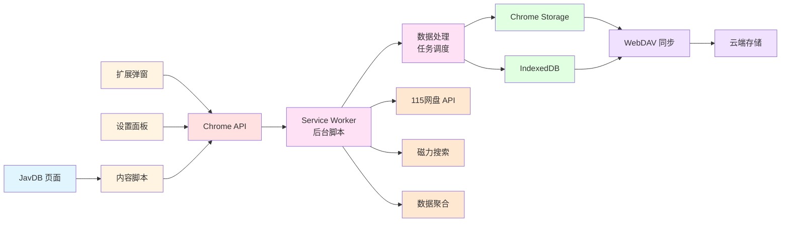

# 架构说明

本页帮助你从整体视角理解 `JavdBviewed`：页面发生了什么、后台做了什么、数据存在哪里、同步与外部服务如何接进来。

如果你准备二开，建议先读完本页，再开始翻具体模块代码。

## 从宏观上看，这个项目在做什么

可以把它理解成一套“页面增强 + 本地数据系统 + 外部服务接入”的浏览器扩展：

- 页面侧负责展示与交互
- 后台负责调度、存储和外部调用
- 本地存储负责保存状态和业务数据
- 外部服务负责同步、离线下载和扩展能力

## 总体架构图

## 先记住这四层

理解这个项目时，最有用的不是记所有文件，而是先记住下面四层。

### 1. 页面层

包括：

- 站点页面中的内容脚本
- 页面上的按钮、标记、增强 UI
- 列表页和详情页的交互逻辑

这一层直接面向用户，负责“看得见、点得到”的东西。

### 2. 后台层

包括：

- Service Worker
- 消息分发
- 数据操作
- 同步与外部服务调用
- 批量任务与定时任务

这一层负责“页面不适合做，但扩展必须统一做”的事情。

### 3. 存储层

包括：

- `Chrome Storage`
- `IndexedDB`

这一层负责持久化配置与业务数据，也是同步和统计能力的基础。

### 4. 外部服务层

包括：

- WebDAV
- 115 网盘
- 磁力搜索源等

这一层把本地扩展能力连接到浏览器之外。

## 各层怎么协作

### 页面层做什么

页面层主要负责：

- 判断当前页面类型
- 初始化对应功能
- 收集用户输入
- 展示结果和状态变化

例如：

- 用户在详情页点“已观看”
- 用户点击“推送 115”
- 用户在列表页看到状态角标或预览入口

### 后台层做什么

后台层主要负责：

- 接收页面消息
- 执行业务逻辑
- 操作数据库
- 调用同步接口和外部 API
- 把结果回传页面或管理界面

可以把它理解成扩展内部的“应用服务中心”。

### 存储层做什么

#### `Chrome Storage`

更适合放：

- 配置项
- 功能开关
- 一些轻量状态

#### `IndexedDB`

更适合放：

- 视频标记记录
- 演员数据
- 新作品记录
- 需要筛选、统计、查询的主业务数据

一个简单判断标准是：

- 这是设置项吗？优先考虑 `Chrome Storage`
- 这是业务数据吗？优先考虑 `IndexedDB`

### 外部服务层做什么

#### WebDAV

用于：

- 多设备同步
- 备份与恢复
- 云端保存业务数据

#### 115 网盘

用于：

- 磁力推送
- 任务处理
- 登录态相关交互

#### 其他扩展能力

例如磁力搜索、数据聚合等，也通常由后台统一接入。

## 最常见的一条数据流

下面是一条很典型的运行路径：

1. 用户在页面上点击某个按钮
2. 内容脚本读取页面上下文
3. 内容脚本向后台发送消息
4. 后台执行业务逻辑
5. 后台写入本地存储或调用外部服务
6. 后台返回处理结果
7. 页面更新 UI

如果你在排查问题时能定位到这 7 步中的哪一步断了，问题通常就已经缩小很多了。

## 为什么项目要这样分层

这样设计的好处主要有三点：

### 交互和业务解耦

页面逻辑不需要直接承载复杂业务，后台也不用直接关心页面细节。

### 方便扩展

新增一个页面增强功能时，不一定要改同步模块；新增一个同步能力时，也不一定要改所有页面交互。

### 方便排错

你可以把问题快速归类到：

- 页面显示问题
- 消息链路问题
- 数据存储问题
- 外部服务问题

## 看源码时建议怎么读

推荐顺序：

1. 先看 [二次开发指南](/developer/development)
2. 再看 `content/` 与 `background/` 的职责边界
3. 再看你关心的具体模块，例如同步、115、Dashboard
4. 最后再看某个细节实现

不要一开始就从单个函数钻进去，不然很容易迷路。

## 对应到目录时怎么找

如果你在代码里找功能，可以按这个思路：

- 页面上显示的问题：优先看 `src/content/`
- 设置面板的问题：优先看 `src/dashboard/`
- 数据、同步、接口调用问题：优先看 `src/background/` 和 `src/services/`
- 通用配置、工具和类型：优先看 `src/utils/`、`src/types/`

## 继续往下读什么

- [二次开发指南](/developer/development)
- [数据同步模块](/developer/data-sync)
- [115 模块说明](/developer/drive115-module)
- [UI 组件说明](/developer/ui-components)

